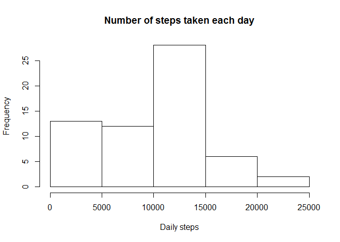
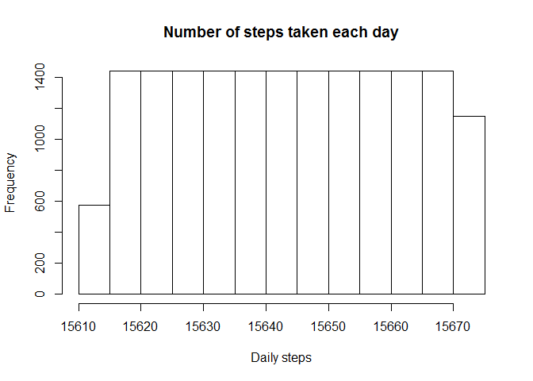
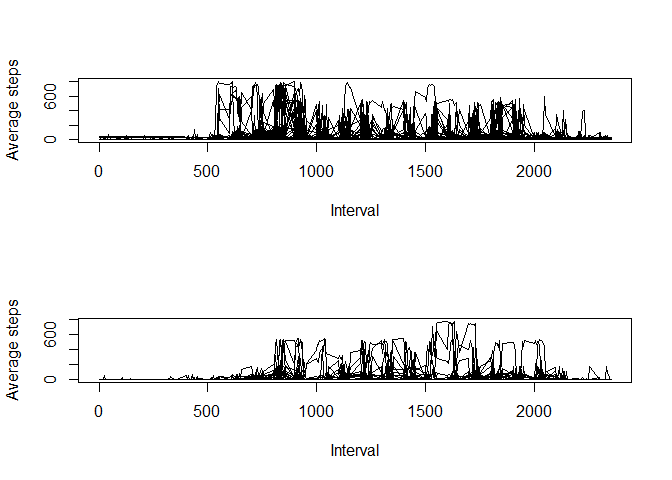

# Reproducible Research: Peer Assessment 1


## Loading and preprocessing the data

```r
datafile <- unzip("activity.zip")
data <- read.csv(datafile, header=TRUE)
```

## What is mean total number of steps taken per day?

```r
# Calculate the total number of steps taken per day
dates <- as.Date(data[[2]])
   
   uniqueDates <- unique(dates)
   stepsTable <- data.frame()
   for (x in uniqueDates){
      y <- dates == x
      stepsPerInterval <- data$steps[y]
      stepsPerDay <- sum(stepsPerInterval, na.rm=TRUE)
      stepsTable <- rbind(stepsTable, c(x, stepsPerDay))
   }
colnames(stepsTable) <- c("Date", "Steps")
# Make a histogram of the total number of steps taken each day
hist(stepsTable[,2], main="Number of steps taken each day", xlab="Daily steps")
```

 

```r
# Calculate and report the mean and median of the total number of steps taken per day
print(paste("Mean:", mean(stepsTable[,2])))
```

```
## [1] "Mean: 9354.22950819672"
```

```r
print(paste("Median:", median(stepsTable[,2])))
```

```
## [1] "Median: 10395"
```

## What is the average daily activity pattern?

```r
uniqueInterval <- unique(data$interval)
intTable <- data.frame()
   for (x in uniqueInterval) {
      u <- x == data$interval
      m <- mean(data$steps[u], na.rm=TRUE)
      intTable <- rbind(intTable, c(x, m))
   }
colnames(intTable) <- c("interval", "steps")
# Create the plot
plot (x=intTable$interval, y=intTable$steps, type="l", ylab="Average steps", xlab="Interval")
```

 

```r
# Which 5-minute interval, on average across all the days in the dataset, contains the maximum number of steps?
maxSteps <- max(intTable$steps)
maxInt <- intTable$interval[intTable$steps[maxSteps]]
print(paste("Maximum average steps:",maxSteps,"at interval", maxInt))
```

```
## [1] "Maximum average steps: 206.169811320755 at interval 435"
```

## Imputing missing values

```r
naSteps <- is.na(data$steps)
print(paste("Missing values in", sum(naSteps), "rows"))
```

```
## [1] "Missing values in 2304 rows"
```

```r
# use the mean for that day to fill in all of the missing values in the dataset
   
   tableLength <- length(dates)
   stepsVector <- numeric()
   rowValue <- numeric()
   for (x in 1:tableLength) {
      if (is.na(data$steps[[x]])) {
         w <- which(intTable$interval == data$interval[x])
         rowValue <- intTable$steps[w]
      }
      else {
         rowValue <- data$steps[x]
      }
   stepsVector <- c(stepsVector, rowValue)      
   }
   newTable <- data.frame(cbind(stepsVector, dates, data$interval))
   names(newTable)<- names(data) 
hist(newTable[,2], main="Number of steps taken each day", xlab="Daily steps")
```

 

```r
# Calculate and report the mean and median of the total number of steps taken per day
print(paste("Mean:", mean(stepsTable[,2])))
```

```
## [1] "Mean: 9354.22950819672"
```

```r
print(paste("Median:", median(stepsTable[,2])))
```

```
## [1] "Median: 10395"
```
## Are there differences in activity patterns between weekdays and weekends?

```r
whatDay <- weekdays(dates)
   dayLevels <- c(rep("weekday", 5), rep("weekend", 2))
   weekdayTable <- cbind(unique(whatDay), dayLevels)
   weekdayVector <- match(whatDay, weekdayTable[,1])
   addLevels <- weekdayTable[weekdayVector,2]
   newTableW <- data.frame(cbind(newTable, addLevels))
   par(mfrow = c(2,1))
   with(subset(newTableW, newTableW$addLevels == "weekday"), plot(interval, steps, type="l", ylab="Average steps", xlab="Interval"))
   with(subset(newTableW, newTableW$addLevels == "weekend"), plot(interval, steps, type="l", ylab="Average steps", xlab="Interval"))
```

 
